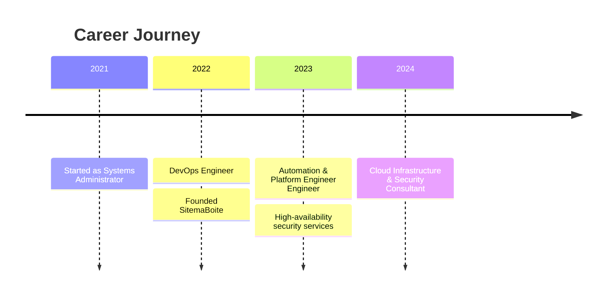

<div align="center">
  
</div>

<div align="center">
  
  [](https://buildbreaklearn.dev)
  [](https://www.linkedin.com/in/piernas-loic)
  [](https://www.malt.fr/profile/lpi-code1)
  [](mailto:loic.piernas@buildbreaklearn.dev)
  
  
  [](https://steamcommunity.com/id/lpi-code)
  
</div>

<div align="center">
  
</div>

## 👨‍💻 About Me

```yaml
name: Loïc Piernas
location: France
current_focus: ["Automation & Platform Engineer", "Cloud Infrastructure", "Security Automation"]
motto: "Build. Break. Learn."
```

🚀 **Automation & Platform Engineer Engineer** with 3+ years of experience building secure, resilient, and scalable cloud infrastructure while integrating security practices into every stage of the development lifecycle.

💡 I'm passionate about:
- 🔧 **Infrastructure as Code** - Terraform & Ansible enthusiast
- 🛡️ **Security-First Approach** - Integrating security into DevOps workflows
- 🐳 **Container Orchestration** - Docker & Kubernetes expert with security hardening
- 📊 **Observability** - Grafana, Prometheus, and monitoring best practices
- 🔄 **CI/CD Pipelines** - Secure automated deployments with GitLab CI/CD & GitHub Actions
- 🌱 **Continuous Learning** - Always exploring new technologies and security practices

🏢 **Founder of SitemaBoite** - Providing expert Automation & Platform Engineer consulting and cloud infrastructure services

<div align="center">
  
</div>

## 🛠️ Tech Stack

### 💻 Languages


### 🔧 Automation & Platform Engineer & Cloud


### ☁️ Cloud Platforms


### 📊 Monitoring & Observability


### 🔒 Security & Compliance


### 🐧 Systems & Databases


<div align="center">
  
</div>

## 📊 GitHub Statistics

<div align="center">
  
  
</div>

<div align="center">
  
  
</div>

<div align="center">
  
</div>

<div align="center">
  
</div>

## 🏆 Certifications & Achievements

<div align="center">

| Certification | Issuer | Status |
|--------------|--------|---------|
| 🛡️ **Stormshield Network Administrator** | Stormshield | ✅ Certified |
| 🌐 **CCNA (Cisco Certified Network Associate)** | Cisco | ✅ Certified |
| 🗣️ **TOEIC** | ETS Global | ✅ Certified |

</div>

<div align="center">
  
</div>

## 📝 Latest Blog Posts

<!-- BLOG-POST-LIST:START -->
- 🧙‍♂️ [How I Tortured a Wizard (LLM Hacks)](https://buildbreaklearn.dev/blog/How%20I%20Tortured%20a%20Wizard%20(LLM%20Hacks))
- 🔒 [Setup a GL.iNet router to bypass censorship (with Mullvad VPN)](https://buildbreaklearn.dev/blog/Setup%20a%20GL.iNet%20router%20to%20bypass%20censorship%20(with%20Mullvad%20VPN))
- 👋 [Welcome to my blog](https://buildbreaklearn.dev/blog/welcome-to-my-blog)
<!-- BLOG-POST-LIST:END -->

➡️ [More blog posts...](https://buildbreaklearn.dev/blog)

<div align="center">
  
</div>

## 💼 Professional Experience



**Key Highlights:**
- 🎯 Designed and implemented CI/CD pipelines reducing deployment time by 70%
- 🏗️ Built infrastructure-as-code solutions managing 100+ production servers
- 🔍 Implemented comprehensive monitoring solutions with Grafana & Prometheus
- 🤝 Collaborated with international teams across multiple time zones
- 🚨 Led incident response and system debugging

<div align="center">
  
</div>

## 🌟 Featured Projects

<div align="center">

| Project | Description | Tech Stack |
|---------|-------------|-----------|
| 🛡️ **Mockpit - Enterprise Security Middleware** | Lead developer of critical security middleware for SAP enterprise infrastructure over 3+ years. Zero-downtime requirement with JWKS-based HA cryptographic architecture. | Backend, Security, High Availability, Enterprise, Mission Critical |
| 🦀 **Crablendar** | Reverse engineered school's calendar app to implement middleware using Rust and Docker, allowing classmates to sync schedules directly to their phones. | Backend, Reverse Engineering, Containerization, API, Personal |
| 🏠 **Homelab Infrastructure (v3 + v4)** | Fully Infrastructure-as-Code home lab: hypervisors provisioned via Terraform and Ansible, Kubernetes clusters deployed with FluxCD—no manual steps required. | IaC, Orchestration, Automation, Virtualization, Monitoring, GitOps, Personal |
| 🚀 **Build Break Learn** | Modern portfolio and blog platform built with React, TypeScript, and Supabase. Features automated deployment pipeline, dark mode, and markdown-based CMS. | Frontend, Full-Stack, CI/CD, Database, Serverless, CMS, Personal |
| 📈 **Metatrader Cloud Deploy (Hetzner PAAS)** | Automated cloud deployment of Metatrader for customer PAAS on Hetzner, using Ansible for provisioning, VNC for remote access, and Bash for orchestration. | Metatrader, Hetzner, Cloud Deployment, PAAS, Ansible, VNC, Bash, Automation, Freelance, IaC |
| 🔒 **GL.iNet Router VPN Setup** | Comprehensive guide to setting up GL.iNet travel router with Mullvad VPN to bypass censorship and geo-restrictions with automatic failover and kill switch. | Networking, VPN, Privacy, Security, Tutorial, Personal |
| 📡 **Freebox Ansible Collection** | Infrastructure as Code collection for managing Freebox configuration through Ansible. Features Python-based modules for automated network device management. | IaC, Automation, Configuration Management, Networking, API Integration, Personal |
| 🤖 **Calisum - Activity Scraper & LLM Summarizer** | Reverse-engineered apprenticeship reports website, built web scraper, integrated LLM-based summarization, and published as Python package on PyPI. | Web Scraping, LLM, CLI Tool, Automation, Reverse Engineering, Personal |

</div>

<div align="center">
  
</div>

## 📈 Contribution Activity

<!--START_SECTION:activity-->
<!--END_SECTION:activity-->

<div align="center">
  
  
  
</div>

<div align="center">
  
</div>

## 💡 Skills & Expertise

<details>
<summary>🎯 Click to expand my skill matrix</summary>

### Infrastructure & Automation
- ✅ Infrastructure as Code (Terraform, Ansible, Pulumi)
- ✅ Configuration Management (Ansible, Chef, Puppet)
- ✅ GitOps (ArgoCD, FluxCD)
- ✅ Service Mesh (Istio, Linkerd)

### Container & Orchestration
- ✅ Docker & Docker Compose
- ✅ Kubernetes (EKS, AKS, GKE, On-prem)
- ✅ Helm Charts & Kustomize
- ✅ Container Security (Trivy, Falco)

### CI/CD & Automation
- ✅ GitLab CI/CD
- ✅ GitHub Actions
- ✅ Jenkins
- ✅ ArgoCD
- ✅ Tekton Pipelines

### Cloud Platforms
- ✅ AWS (EC2, S3, Lambda, ECS, EKS, RDS, CloudFormation)
- ✅ Microsoft Azure (VM, AKS, Storage, Functions)
- ✅ OpenStack

### Monitoring & Logging
- ✅ Prometheus & Alertmanager
- ✅ Grafana & Loki
- ✅ ELK Stack (Elasticsearch, Logstash, Kibana)
- ✅ Datadog, New Relic

### Security & Compliance
- ✅ Network Security (Stormshield, Firewall Management)
- ✅ Security Scanning (Trivy, SonarQube)
- ✅ Secrets Management (Vault, Sealed Secrets)
- ✅ Compliance Automation

</details>

<div align="center">
  
</div>

## 📫 Let's Connect!

<div align="center">

I'm always interested in collaborating on exciting projects, discussing Automation & Platform Engineer best practices, or helping with consulting opportunities!

[](https://buildbreaklearn.dev)

[](https://www.linkedin.com/in/piernas-loic)
[](https://www.malt.fr/profile/lpi-code1)
[](mailto:loic.piernas@buildbreaklearn.dev)

</div>

<div align="center">
  
</div>

<div align="center">
  
  ### 💭 Random Dev Quote
  
  
  ### 😂 A bit of Automation & Platform Engineer Humor
  
  
</div>

<div align="center">
  
</div>

<div align="center">
  
  **⭐ From [lpi-code](https://github.com/lpi-code) | 🚀 Build. Break. Learn. 🚀**
  
  *"The best way to predict the future is to automate it."*
  
  
</div>
